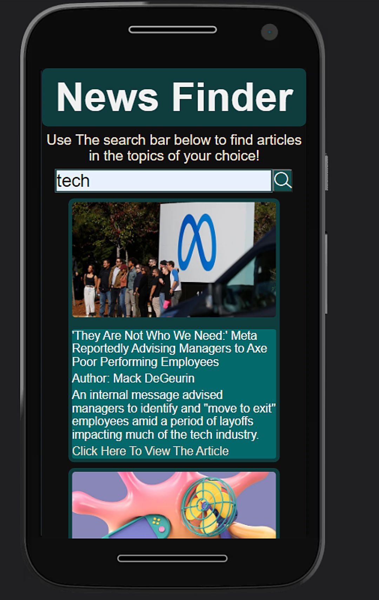

# News Finder (A New News App)

## Table Of Contents

- [Screenshot](#Screenshot)
- [Description](#Description)
- [Author](#Author)
- [Installation](#Installation)
- [Usage](#Usage)
- [Credits](#Credits)
- [License](#License)
- [Technology](#Technology)

## Screenshot

## Description

This app helps you find a wide selection of articles from topics of your choosing! Simply search a topic and get a feed of articles that are relavant to your search. This was made in help by the [news api](https://newsapi.org)

## Technology

Technologies Used In This App:

<ul>
<li>React</li>
<li>Javascript</li>
<li>CSS</li>
</ul>  
API: 
<ul>
<li>News Api</li>
</ul> 
NPMS: 
<ol>
<li>React Loader Spinner</li>
</ul> 
  
## Author
  
Name: Brandon Diaz
  
Contact email: brandonjustindiaz@yahoo.com
  
GitHub: [1Clide1](https://github.com/1Clide1)

## Installation

To run this app, first you need your own news api key. Simply go to newsapi.org and create an account, they will then in turn give you a key. After obtaining an api key, simply clone this repo or you can also download the source code in a zip file. Once you have cloned or downloaded the repo, go to the utils folder (preferably using a text editor like vscode) there you will see a file called API.js go into that file and simply paste your api key under the api key variable. After that is done you are good to go and you can run the app in local host to see how it works.

## Usage

To use this app, like I said once it's up and running you just have type in a topic you want to see and you will automatically get the results for that topic!

## Credits

I think this project went really well for me, I didn't focus too much on design and just made sure it worked in mobile viewing. I am still learning context api so I am not sure if I went about it the right way however, I do not think I made a janky solution so I will count that as a win for me. I did run into an issue with the context api just trying to use the state that stores the news data too early. What I mean by that is once I had the card layout as I wanted it to if I were to refresh the page the app would freak out because it was trying to render out the cards before I searched something. I made a loading state and that seemed to do the trick. That in turn made another issue in that the request happens too fast so you can't see the loading animation at all really. I think in the future I would just have to make a set time out function that waits a few seconds before giving the green light to show the information. My last issue which I am honestly not too sure to fix was I found out a nice way to compare the news article titles by using the sort function and .localcompare however .localcompare essentially says ' character comes before the letter A and I was not sure on how I would go about fixing that other than that I was honestly surprised to find a method that was clean and efficient while learning new things about javascript. Overall I am happy with how this turned out in a short notice.
